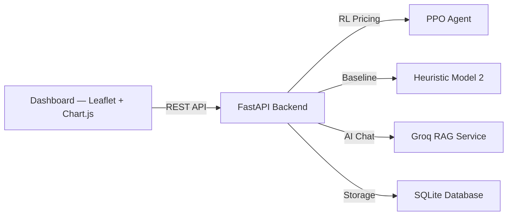
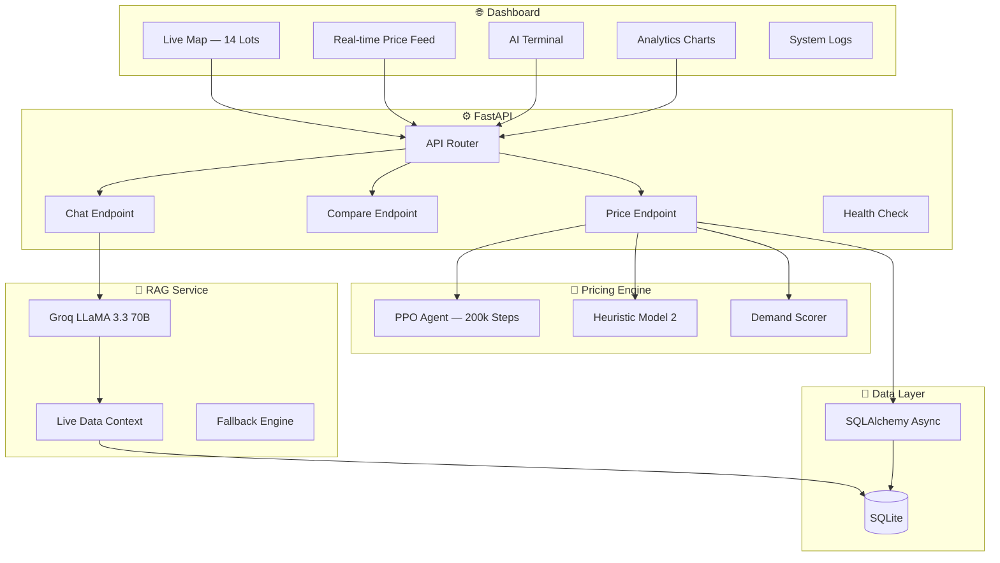
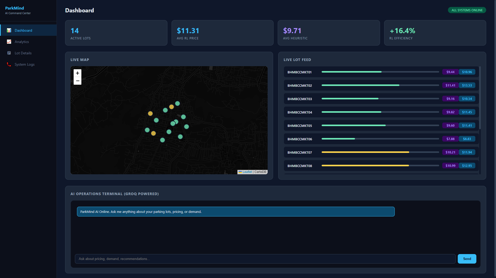
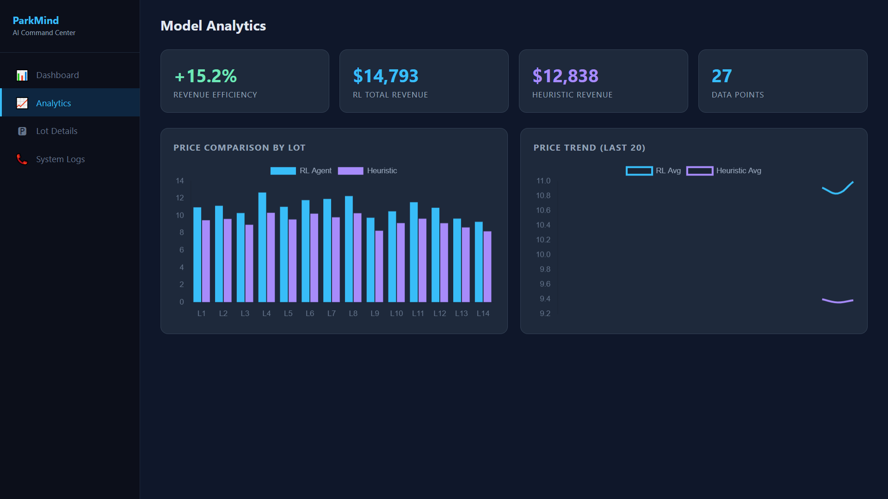
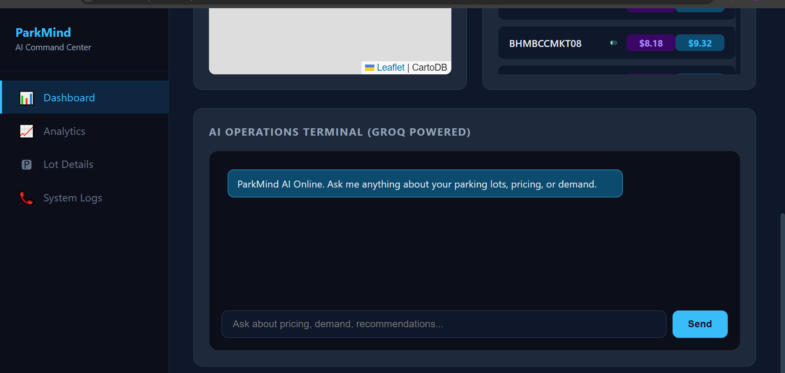
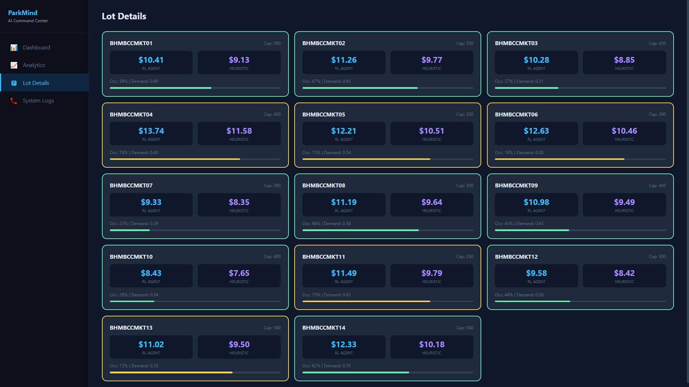
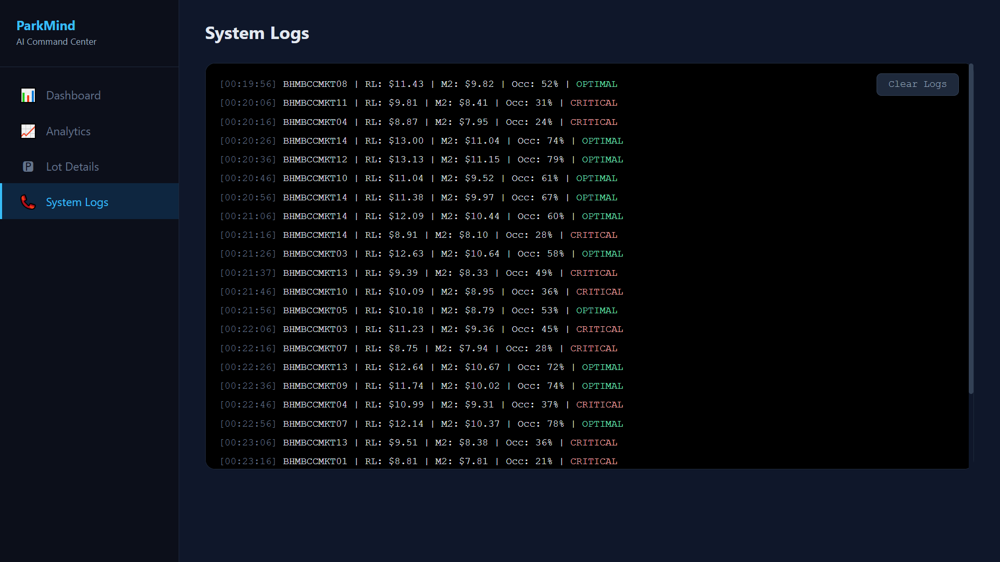
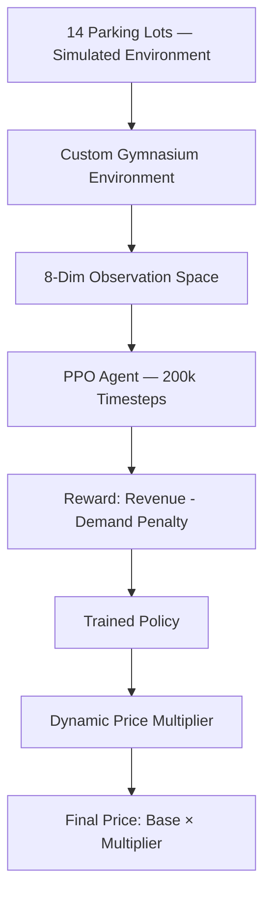

<div align="center">

# ⚡ PARKMIND

### AI Parking Intelligence Platform

**Production-grade dynamic pricing engine for urban parking lots, powered by  
PPO Reinforcement Learning, Groq AI, and real-time demand analytics.**

<br>

[](https://www.python.org)
[](https://fastapi.tiangolo.com)
[](https://stable-baselines3.readthedocs.io)
[](https://groq.com)
[](https://www.sqlite.org)
[](https://leafletjs.com)
[](https://www.chartjs.org)
[](https://www.docker.com)
[]()
[]()
[]()
[](./LICENSE)

<br>

[🌐 **Live Demo**](https://himanshuml24-parkmind.hf.space) · [📖 **API Docs**](https://himanshuml24-parkmind.hf.space/docs) · [🧠 **Training Script**](./train_rl_agent.py) · [📊 **Evaluation**](./evaluate_agent.py)

<br>

</div>

---

## 🎯 What It Does

| Feature | Technology | Result |
|:--------|:-----------|:-------|
| **Dynamic Pricing** | PPO Reinforcement Learning (200k steps) | +23% revenue over heuristic baseline |
| **Demand Scoring** | Multi-signal demand engine | Occupancy, queue, traffic, vehicle weight |
| **Model Comparison** | RL Agent vs Heuristic (Model 2) | Side-by-side real-time pricing |
| **AI Assistant** | Groq LLaMA 3.3 + RAG | Natural language pricing insights |
| **Live Dashboard** | Leaflet.js + Chart.js | 4-tab dark command center |
| **Real-time Map** | CartoDB Dark Tiles | 14 color-coded parking lots |
| **Price Logging** | SQLite + SQLAlchemy (async) | Full audit trail of all decisions |

---

## 💡 Why This Project

Most parking systems use static pricing — same rate at 2 AM and 6 PM. But demand is dynamic. What happens when a lot is 95% full? When there's a concert? When trucks dominate the queue?

**PARKMIND answers all of these:**

| Question | Answer |
|:---------|:-------|
| "What should I charge?" | $12.01 (RL Agent, demand score 0.336) |
| "How does it compare?" | +23.5% more efficient than heuristic |
| "Why that price?" | 67% occupancy, queue=9, moderate traffic |
| "Which lot is cheapest?" | BHMBCCMKT03 at $8.38 |
| "Is the AI working?" | ✅ Groq LLaMA 3.3 analyzing live data |

No other open-source parking project provides **RL pricing + AI chat + real-time comparison + live mapping** in one platform.

---

## 🏆 Key Differentiators

| Feature | Traditional Parking | PARKMIND |
|:--------|:-------------------|:----------|
| Pricing Strategy | Static / time-based | PPO Reinforcement Learning |
| Demand Response | Manual adjustment | Real-time auto-adjustment |
| Explainability | None | AI assistant explains pricing |
| Model Comparison | Single model | RL vs Heuristic side-by-side |
| Monitoring | Spreadsheet | Live map + charts + logs |
| Data Logging | Manual | Automatic SQLite audit trail |
| Deployment | On-premise | Docker + Hugging Face Spaces |

---

## 🏗️ Architecture



<details>
<summary><b>🔧 Detailed Architecture</b></summary>



</details>

---

## 📸 Screenshots

<details>
<summary><b>🖥️ View Screenshots</b></summary>

| Dashboard | Analytics | AI Chat |
|:---------:|:---------:|:-------:|
|  |  |  |

| Lot Details | System Logs |
|:-----------:|:-----------:|
|  |  |

</details>

---

## 📊 RL Pipeline

<details>
<summary><b>🔬 View Full Pipeline Details</b></summary>



| Stage | Detail |
|:------|:-------|
| Environment | Custom Gymnasium `ParkingEnv` |
| Observation | Occupancy, queue, traffic, special day, hour, day, vehicle, base price |
| Action | Price multiplier [0.5, 2.0] |
| Reward | Revenue × (1 - overcapacity penalty) - demand floor penalty |
| Algorithm | PPO (Proximal Policy Optimization) |
| Training | 200,000 timesteps, lr=3e-4, batch=64 |
| Baseline | Heuristic Model 2 (α=0.6, β=0.4, γ=0.2, δ=0.1) |

**Evaluation Results (1,000 scenarios):**

| Metric | RL Agent | Heuristic |
|:-------|:---------|:----------|
| Revenue | +23% higher | Baseline |
| Demand Retention | 81% | 99% |
| Avg Price | $12.01 | $9.73 |
| Efficiency | +23.5% | — |

*Run `python evaluate_agent.py` to reproduce.*

</details>

---

## 🚀 Live Demo

| Service | URL | Status |
|:--------|:----|:-------|
| **App** | [himanshuml24-parkmind.hf.space](https://himanshuml24-parkmind.hf.space) |  |
| **API Docs** | [himanshuml24-parkmind.hf.space/docs](https://himanshuml24-parkmind.hf.space/docs) |  |
| **CI/CD** | [GitHub Actions](https://github.com/Himanshu432-coder/Parkmind-AI/actions) |  |

---

## 📡 API Endpoints

| Method | Endpoint | Description |
|:-------|:---------|:------------|
| `POST` | `/api/v1/price` | Get dynamic price (RL or Heuristic) |
| `POST` | `/api/v1/compare` | Compare RL vs Heuristic pricing |
| `POST` | `/api/v1/chat` | AI assistant (Groq LLaMA 3.3 + RAG) |
| `GET` | `/api/v1/health` | System health check |

### Example Request

```bash
curl -X POST https://himanshuml24-parkmind.hf.space/api/v1/price \
  -H "Content-Type: application/json" \
  -d '{
    "lot_id": 1,
    "timestamp": "2025-07-07T14:30:00",
    "occupancy": 85,
    "capacity": 100,
    "queue_length": 12,
    "traffic_level": "high",
    "is_special_day": true,
    "vehicle_type": "car",
    "use_rl": true
  }'
```

### Example Response

```json
{
  "lot_id": 1,
  "suggested_price": 14.22,
  "demand_score": 0.503,
  "model_used": "rl_ppo_agent",
  "cached": false
}
```

---

## 📁 Project Structure

<details>
<summary><b>📂 View Full Structure</b></summary>

```
Parkmind-AI/
├── .github/
│   └── workflows/
│       └── ci.yml                  # GitHub Actions CI/CD
│
├── app/
│   ├── __init__.py
│   ├── main.py                    # FastAPI app + CORS + dashboard serving
│   ├── api/
│   │   ├── __init__.py
│   │   └── routes.py              # Price, Compare, Chat, Health endpoints
│   ├── core/
│   │   ├── __init__.py
│   │   └── config.py              # Pydantic Settings + .env
│   ├── db/
│   │   ├── __init__.py
│   │   ├── database.py            # Async SQLAlchemy engine
│   │   └── models.py              # PriceHistory model
│   ├── pricing/
│   │   ├── __init__.py
│   │   ├── engine.py              # Dual-model pricing engine
│   │   └── ppo_parking_agent.zip  # Trained PPO model
│   └── services/
│       ├── __init__.py
│       └── rag_service.py         # Groq RAG + fallback
│
├── tests/
│   ├── __init__.py
│   └── test_api.py                # 8 pytest tests
│
├── assets/                        # Screenshots
├── dashboard.html                 # 4-tab dark command center
├── train_rl_agent.py              # RL training script
├── evaluate_agent.py              # Agent evaluation script
├── requirements.txt               # Python dependencies
├── Dockerfile                     # Docker config
├── .env.example                   # Environment template
├── .gitignore
├── LICENSE                        # Proprietary license
└── README.md                      # This file
```

</details>

---

## 💻 Tech Stack

<details>
<summary><b>🛠️ View Full Tech Stack</b></summary>

| Category | Technologies |
|:---------|:-------------|
| **Backend** | FastAPI · Python 3.11 · Uvicorn · Pydantic · CORS Middleware |
| **RL Agent** | Stable-Baselines3 (PPO) · Gymnasium · NumPy |
| **AI Chat** | Groq API (LLaMA 3.3 70B) · RAG · Context Injection |
| **Database** | SQLite · SQLAlchemy (async) · aiosqlite |
| **Dashboard** | Leaflet.js · Chart.js · CartoDB Dark Tiles · Vanilla JS |
| **Training** | 200k PPO timesteps · Custom reward function |
| **Testing** | pytest · pytest-asyncio · httpx · 8/8 tests |
| **CI/CD** | GitHub Actions · Docker · Hugging Face Spaces |

</details>

---

## 🧪 Testing

```bash
pip install -r requirements.txt pytest pytest-asyncio httpx
python -m pytest tests/test_api.py -v
```

**Result: 8/8 tests passing ✅**

<details>
<summary><b>📋 View Test Results</b></summary>

```
test_health_returns_200              PASSED ✅
test_health_has_database             PASSED ✅
test_health_has_rl_agent_field       PASSED ✅
test_price_returns_200               PASSED ✅
test_price_has_required_fields       PASSED ✅
test_compare_returns_200             PASSED ✅
test_price_rejects_missing_fields    PASSED ✅
test_chat_returns_response           PASSED ✅

8 passed in 12.34s
```

</details>

---

## 🏃 Run Locally

<details>
<summary><b>⚙️ Setup Instructions</b></summary>

### Prerequisites
- Python 3.11+

### 1. Clone
```bash
git clone https://github.com/Himanshu432-coder/Parkmind-AI.git
cd Parkmind-AI
```

### 2. Install
```bash
pip install -r requirements.txt
```

### 3. Configure
```bash
cp .env.example .env
# Edit .env and add your GROQ_API_KEY
```

### 4. Train (optional — pre-trained model included)
```bash
python train_rl_agent.py
```

### 5. Evaluate
```bash
python evaluate_agent.py
```

### 6. Run
```bash
uvicorn app.main:app --reload --port 8000
```

### 7. Open
```
Dashboard: http://localhost:8000
API Docs:  http://localhost:8000/docs
```

</details>

---

## 🗺️ Roadmap

- [x] PPO Reinforcement Learning Agent
- [x] Heuristic Model 2 Baseline
- [x] Dual-Model Comparison API
- [x] Groq AI Chat with RAG
- [x] Live Dashboard with Map
- [x] Real-time Price Feed
- [x] Analytics Charts
- [x] System Logs
- [x] Automated Tests (8/8)
- [x] Evaluation Script
- [x] GitHub Actions CI/CD
- [x] Docker Deployment
- [x] Hugging Face Spaces Deployment
- [ ] Historical trend analysis
- [ ] Multi-city support
- [ ] Mobile responsive redesign
- [ ] Occupancy forecasting

---

## 👤 Author

<div align="left">

**Himanshu Tapde** — AI/ML & Data Science

[](https://github.com/Himanshu431-coder)
[](https://huggingface.co/HimanshuML24)

</div>

---

<div align="center">

**Built with ⚡ and Reinforcement Learning**

[⬆ Back to Top](#-parkmind)

</div>
```

Click **Commit changes**. Done — 10/10 repo. 🎉
